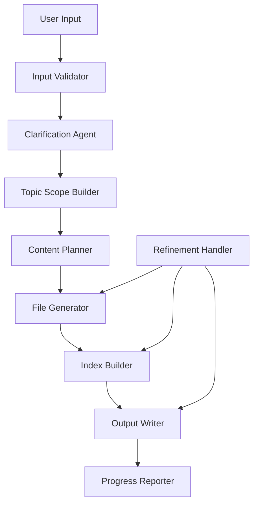

# Design Document: Context Generation

## Overview

The Context Generation system is a CLI/agent-driven tool that accepts a topic and use case from a user, refines the request through interactive clarification questions, and produces a structured set of markdown files that give a model comprehensive understanding of the topic. The system orchestrates three main phases: input validation, interactive clarification, and file generation with progress feedback. Post-generation, users can iteratively refine the output.

The system is designed as a pipeline of discrete, composable stages. Each stage has clear inputs and outputs, making the system testable and extensible. The core logic is pure text transformation and orchestration — no external databases or cloud services are required.

## Architecture

The system follows a layered pipeline architecture:



**Design Decisions:**

1. **Pipeline over monolith**: Each stage is a separate module with defined interfaces. This allows unit testing of each stage independently and makes it easy to swap implementations (e.g., different LLM backends for the clarification agent).

2. **Stateful session model**: A generation session holds the accumulated state (original input, clarification answers, planned structure, generated files). This enables iterative refinement without re-running the entire pipeline.

3. **File-system as output**: Generated context is written directly to the file system as markdown files. No database layer is needed — the file system is the persistence layer.

4. **Synchronous generation with progress callbacks**: Files are generated sequentially with progress reported after each file. This keeps the implementation simple while providing user feedback.

## Components and Interfaces

### InputValidator

Validates user-provided topic and use case descriptions against length and content constraints.

```typescript
interface InputValidator {
  validateTopicDescription(input: string): ValidationResult;
  validateUseCaseDescription(input: string): ValidationResult;
}

interface ValidationResult {
  valid: boolean;
  error?: string;
}
```

### ClarificationAgent

Analyzes input to generate targeted questions, processes answers, and produces a refined topic scope.

```typescript
interface ClarificationAgent {
  generateQuestions(topic: string, useCase: string): ClarificationQuestion[];
  processAnswers(questions: ClarificationQuestion[], answers: string[]): TopicScope;
  isComplete(): boolean;
}

interface ClarificationQuestion {
  id: string;
  text: string;
  purpose: string; // Why this question helps refine the topic
}

interface TopicScope {
  originalTopic: string;
  originalUseCase: string;
  refinements: string[];
  summary: string;
}
```

### ContentPlanner

Determines the structure of the context set — how many files, what subtopics, and how they relate.

```typescript
interface ContentPlanner {
  planContextSet(scope: TopicScope): ContentPlan;
}

interface ContentPlan {
  files: PlannedFile[];
  estimatedTotal: number;
}

interface PlannedFile {
  subtopic: string;
  filename: string;
  description: string;
  relatedFiles: string[]; // filenames this file should cross-reference
}
```

### FileGenerator

Generates the markdown content for a single context file based on the plan.

```typescript
interface FileGenerator {
  generateFile(planned: PlannedFile, scope: TopicScope, existingFiles: GeneratedFile[]): GeneratedFile;
}

interface GeneratedFile {
  filename: string;
  title: string;
  content: string;
  crossReferences: CrossReference[];
}

interface CrossReference {
  targetFilename: string;
  anchorText: string;
}
```

### IndexBuilder

Produces the index.md file that lists and describes all context files.

```typescript
interface IndexBuilder {
  buildIndex(files: GeneratedFile[]): string;
}
```

### OutputWriter

Writes generated files to the file system in a dedicated output directory.

```typescript
interface OutputWriter {
  writeContextSet(outputDir: string, files: GeneratedFile[], index: string): WriteResult;
  writeFile(outputDir: string, file: GeneratedFile): WriteResult;
  removeFile(outputDir: string, filename: string): WriteResult;
}

interface WriteResult {
  success: boolean;
  error?: string;
  path?: string;
}
```

### ProgressReporter

Reports generation progress to the user.

```typescript
interface ProgressReporter {
  onStart(estimatedTotal: number): void;
  onFileComplete(filename: string, completed: number, total: number): void;
  onFileError(filename: string, error: string): void;
  onComplete(files: GeneratedFile[]): void;
}
```

### RefinementHandler

Handles post-generation modifications: editing, adding, and removing files.

```typescript
interface RefinementHandler {
  modifyFile(filename: string, feedback: string, session: GenerationSession): GeneratedFile;
  addFile(subtopic: string, session: GenerationSession): GeneratedFile;
  removeFile(filename: string, session: GenerationSession): RemoveResult;
}

interface RemoveResult {
  success: boolean;
  error?: string;
}
```

### GenerationSession

Holds the accumulated state for a single context generation request.

```typescript
interface GenerationSession {
  topicDescription: string;
  useCaseDescription: string;
  scope: TopicScope;
  plan: ContentPlan;
  generatedFiles: GeneratedFile[];
  outputDir: string;
}
```

## Data Models

### Input Models

| Field | Type | Constraints |
|-------|------|-------------|
| topicDescription | string | 10–2000 non-whitespace chars required |
| useCaseDescription | string | 10–1000 non-whitespace chars required |

### Filename Generation Rules

- Derived from the subtopic title
- Converted to kebab-case
- Maximum 60 characters including `.md` extension
- Characters allowed: `[a-z0-9-]`
- Must end with `.md`

### Context File Structure

```markdown
# {Subtopic Title}

{Content body — minimum 200 characters excluding the H1 heading}

{Optional cross-references as relative markdown links}
```

### Index File Structure

```markdown
# Index

- [{Subtopic Title}](./{filename}) — {One-to-two sentence description}
- [{Subtopic Title}](./{filename}) — {One-to-two sentence description}
...
```

### Clarification Session State

| Field | Type | Description |
|-------|------|-------------|
| round | number | Current round (1–3) |
| questionsAsked | ClarificationQuestion[] | All questions asked so far |
| answersReceived | Map<string, string> | Question ID → answer |
| maxRounds | number | Always 3 |
| maxQuestionsPerRound | number | Always 3 |
| totalQuestionsLimit | number | Always 5 |

## Correctness Properties

*A property is a characteristic or behavior that should hold true across all valid executions of a system — essentially, a formal statement about what the system should do. Properties serve as the bridge between human-readable specifications and machine-verifiable correctness guarantees.*

### Property 1: Valid input acceptance

*For any* string with at least 10 non-whitespace characters and a total length not exceeding the field's maximum (2000 for topic, 1000 for use case), the InputValidator SHALL accept the input as valid.

**Validates: Requirements 1.1, 1.2**

### Property 2: Invalid input rejection — insufficient content

*For any* string that is empty, contains only whitespace characters, or contains fewer than 10 non-whitespace characters, the InputValidator SHALL reject the input with an appropriate error message.

**Validates: Requirements 1.4, 1.5**

### Property 3: Invalid input rejection — exceeds maximum length

*For any* string exceeding 2000 characters (topic) or 1000 characters (use case), the InputValidator SHALL reject the input with an error message indicating the maximum allowed length.

**Validates: Requirements 1.6**

### Property 4: Clarification question count bounds

*For any* valid topic and use case input, the ClarificationAgent SHALL generate between 1 and 5 questions inclusive.

**Validates: Requirements 2.1**

### Property 5: Clarification question batch size

*For any* set of clarification questions presented to the user, each batch SHALL contain no more than 3 questions.

**Validates: Requirements 2.2**

### Property 6: Topic scope preserves original input

*For any* clarification session that produces a TopicScope, the resulting scope SHALL contain the original topic description and original use case description unchanged.

**Validates: Requirements 2.3**

### Property 7: Clarification session terminates

*For any* clarification session, the session SHALL signal completion (isComplete returns true) after at most 3 rounds of questions or when all generated questions have been answered, whichever comes first.

**Validates: Requirements 2.4**

### Property 8: Context file subtopic uniqueness

*For any* generated Context_Set, no two Context_Files SHALL have the same subtopic title or filename.

**Validates: Requirements 3.2**

### Property 9: Context file structural validity

*For any* generated Context_File, the first line SHALL be an H1 markdown heading (starting with "# "), and the content following the heading SHALL be at least 200 characters in length.

**Validates: Requirements 3.3, 3.4**

### Property 10: Context set size bounds

*For any* generated Context_Set, the number of Context_Files SHALL be between 2 and 10 inclusive.

**Validates: Requirements 3.5**

### Property 11: Filename format validity

*For any* subtopic title, the generated filename SHALL be kebab-case (matching pattern `[a-z0-9]+(-[a-z0-9]+)*\.md`), end with `.md`, and be at most 60 characters in total length.

**Validates: Requirements 4.2**

### Property 12: Index completeness and accuracy

*For any* Context_Set at any point in time (after generation, after addition, after removal), the index.md file SHALL contain exactly one entry for each Context_File in the set, where each entry includes a relative markdown link to the file and a one-to-two sentence description.

**Validates: Requirements 4.1, 6.2, 6.3**

### Property 13: Cross-reference integrity

*For any* Context_Set at any point in time, every relative markdown link within any Context_File SHALL point to a file that exists in the Context_Set. No broken links SHALL exist.

**Validates: Requirements 4.4, 4.5, 6.4**

### Property 14: Progress reporting completeness

*For any* context generation that produces N files successfully, exactly N progress callbacks SHALL be emitted, each with a correct incrementing completed count from 1 to N.

**Validates: Requirements 5.2**

### Property 15: Minimum file count enforcement

*For any* Context_Set containing exactly 2 files, a removal request for any file SHALL be rejected with an error indicating the minimum file count constraint.

**Validates: Requirements 6.5**

### Property 16: Invalid file reference error reporting

*For any* Context_Set and any filename that does not exist in the set, a modification or removal request referencing that filename SHALL return an error that lists all available Context_Files in the set.

**Validates: Requirements 6.6**

## Error Handling

### Input Validation Errors

| Error Condition | Response |
|----------------|----------|
| Topic too short (< 10 non-whitespace chars) | Return error: "Topic description requires at least 10 characters of content. Please provide more detail." |
| Use case too short (< 10 non-whitespace chars) | Return error: "Use case description requires at least 10 characters of content. Please provide more detail." |
| Topic exceeds 2000 chars | Return error: "Topic description exceeds maximum length of 2000 characters." |
| Use case exceeds 1000 chars | Return error: "Use case description exceeds maximum length of 1000 characters." |
| Missing use case | Prompt user to provide use case before proceeding |

### Generation Errors

| Error Condition | Response |
|----------------|----------|
| Single file generation fails | Log error, report to user with filename, continue generating remaining files |
| All files fail to generate | Report complete failure with error details |
| Output directory not writable | Report error before generation begins |
| Index generation fails | Report error, files are still available in output directory |

### Refinement Errors

| Error Condition | Response |
|----------------|----------|
| Referenced file not found | Return error listing available files |
| Removal would violate minimum (2 files) | Reject with explanation of minimum constraint |
| Cross-reference target removed | Update all links pointing to removed file to plain text |

### Error Recovery Strategy

- **Partial generation**: If some files succeed and others fail, the system preserves successful files and reports failures individually.
- **Index consistency**: After any error, the index is regenerated to reflect only the files that actually exist.
- **Idempotent writes**: File writes are atomic — a file is either fully written or not written at all.

## Testing Strategy

### Unit Tests

Unit tests cover specific examples and edge cases:

- Input validation boundary cases (exactly 10 chars, exactly at max length, one over max)
- Filename generation with special characters, very long titles, unicode
- Index building with 0, 1, 2, and 10 files
- Cross-reference resolution with circular references
- Clarification session state transitions
- Error message formatting
- Skip clarification flow

### Property-Based Tests

Property-based tests verify universal correctness properties using the [fast-check](https://github.com/dubzzz/fast-check) library (TypeScript).

**Configuration:**
- Minimum 100 iterations per property test
- Each test tagged with: `Feature: context-generation, Property {N}: {title}`

**Properties to implement:**
1. Input validation acceptance/rejection (Properties 1–3)
2. Clarification agent constraints (Properties 4–7)
3. File structure invariants (Properties 8–11)
4. Set-level invariants (Properties 12–13)
5. Progress reporting (Property 14)
6. Refinement constraints (Properties 15–16)

**Generators needed:**
- Random strings with controlled whitespace/length characteristics
- Random subtopic titles (varying length, character sets)
- Random Context_Set instances (varying file counts, cross-references)
- Random clarification question sets (1–5 questions)

### Integration Tests

Integration tests verify end-to-end flows:

- Full pipeline: input → clarification → generation → output
- Refinement cycle: generate → modify → verify consistency
- Error resilience: inject failures at each stage, verify graceful handling
- File system interaction: verify files are written correctly to disk

### Test Organization

```
tests/
├── unit/
│   ├── input-validator.test.ts
│   ├── filename-generator.test.ts
│   ├── index-builder.test.ts
│   ├── cross-reference-resolver.test.ts
│   └── clarification-session.test.ts
├── property/
│   ├── input-validation.property.test.ts
│   ├── clarification-agent.property.test.ts
│   ├── file-structure.property.test.ts
│   ├── context-set-invariants.property.test.ts
│   └── refinement.property.test.ts
└── integration/
    ├── full-pipeline.test.ts
    ├── refinement-cycle.test.ts
    └── error-resilience.test.ts
```

