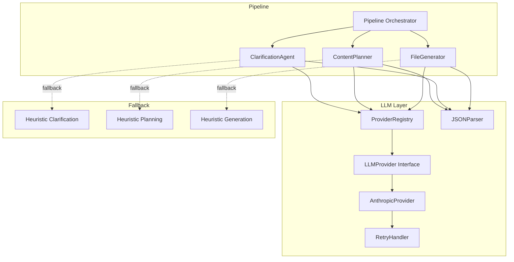
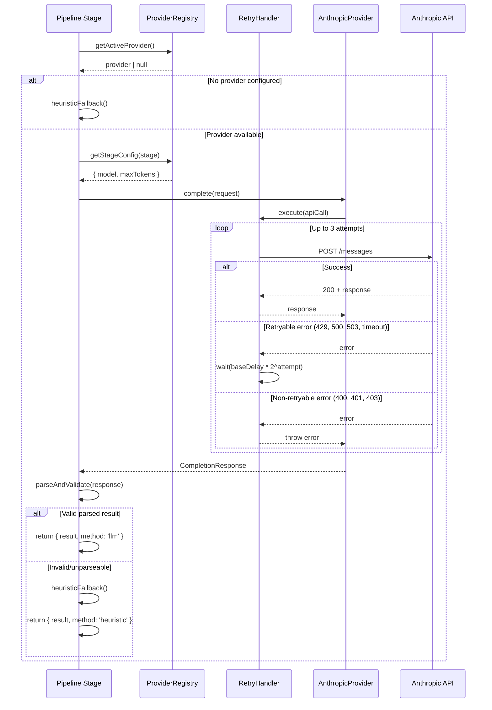

# Design Document: LLM Provider Integration

## Overview

This design introduces an LLM provider abstraction layer into the existing Context Generation system. The system currently uses heuristic/template-based implementations for its three pipeline stages (ClarificationAgent, ContentPlanner, FileGenerator). This feature adds:

1. An `LLMProvider` interface with a `complete()` method for uniform LLM access
2. An Anthropic Claude adapter using `@anthropic-ai/sdk`
3. A Provider Registry for environment-based configuration and model mapping
4. Integration into all three pipeline stages with graceful fallback to heuristics
5. Retry logic with exponential backoff for transient failures
6. Robust JSON parsing for structured LLM responses

The design preserves all existing interfaces (`ContentPlan`, `GeneratedFile`, `ClarificationQuestion`) and ensures the system continues to function identically when no LLM provider is configured.

## Architecture



**Key architectural decisions:**

- **Strategy pattern**: Each pipeline stage attempts the LLM path first, falling back to the existing heuristic implementation on failure. This keeps the heuristic code intact and testable independently.
- **Centralized registry**: A single `ProviderRegistry` resolves the active provider and stage-specific configuration from environment variables, avoiding scattered env var reads.
- **Retry at the provider level**: The retry handler wraps the provider's `complete()` method, so all callers benefit from retry logic without implementing it themselves.
- **JSON parsing as a shared utility**: A single `JSONParser` module handles extraction, validation, and error reporting for all stages.

## Components and Interfaces

### LLMProvider Interface

```typescript
// src/llm/interfaces.ts

export interface CompletionMessage {
  role: 'system' | 'user' | 'assistant';
  content: string;
}

export interface CompletionRequest {
  messages: CompletionMessage[];
  model: string;
  maxTokens?: number;        // 1–128000, default 4096
  temperature?: number;      // 0.0–2.0
  stopSequences?: string[];
}

export interface TokenUsage {
  promptTokens: number;
  completionTokens: number;
  totalTokens: number;       // invariant: totalTokens === promptTokens + completionTokens
}

export interface CompletionResponse {
  content: string;
  usage: TokenUsage;
}

export interface LLMProvider {
  readonly name: string;  // lowercase alphanumeric + hyphens, non-empty
  complete(request: CompletionRequest): Promise<CompletionResponse>;
}
```

### AnthropicProvider

```typescript
// src/llm/anthropic-provider.ts

import Anthropic from '@anthropic-ai/sdk';
import { LLMProvider, CompletionRequest, CompletionResponse } from './interfaces.js';

export class AnthropicProvider implements LLMProvider {
  readonly name = 'anthropic';
  private client: Anthropic;

  constructor() {
    const apiKey = process.env.ANTHROPIC_API_KEY?.trim();
    if (!apiKey) {
      throw new Error('ANTHROPIC_API_KEY environment variable is not configured');
    }
    this.client = new Anthropic({ apiKey, timeout: 30_000 });
  }

  async complete(request: CompletionRequest): Promise<CompletionResponse> {
    // Validate request
    // Map messages: extract system messages to top-level param
    // Forward optional parameters
    // Extract response content and token usage
  }
}
```

### ProviderRegistry

```typescript
// src/llm/provider-registry.ts

export type PipelineStage = 'planner' | 'generator' | 'clarifier';

export interface StageConfig {
  model: string;
  maxTokens: number;
}

export class ProviderRegistry {
  private providers: Map<string, LLMProvider> = new Map();

  register(provider: LLMProvider): void;
  getActiveProvider(): LLMProvider | null;
  getStageConfig(stage: PipelineStage): StageConfig;
}
```

**Environment variable resolution order for model:**
1. Stage-specific: `LLM_MODEL_PLANNER`, `LLM_MODEL_GENERATOR`, `LLM_MODEL_CLARIFIER`
2. Default: `LLM_MODEL_DEFAULT`
3. Hardcoded fallback: `"claude-sonnet-4-20250514"`

**Environment variable resolution for maxTokens:**
1. Stage-specific: `LLM_MAX_TOKENS_PLANNER`, `LLM_MAX_TOKENS_GENERATOR`, `LLM_MAX_TOKENS_CLARIFIER`
2. Hardcoded fallback: `4096`

### RetryHandler

```typescript
// src/llm/retry-handler.ts

export interface RetryOptions {
  maxAttempts: number;       // default: 3
  baseDelayMs: number;       // default: 1000
  timeoutMs: number;         // default: 30000
}

export class RetryHandler {
  constructor(private options: RetryOptions = { maxAttempts: 3, baseDelayMs: 1000, timeoutMs: 30000 });

  async execute<T>(operation: () => Promise<T>): Promise<T>;

  private isRetryable(error: unknown): boolean;
  // Retryable: network timeout, HTTP 429, 500, 503
  // Non-retryable: HTTP 400, 401, 403
}
```

**Backoff schedule:** 1s → 2s → 4s (base × 2^attempt)

### JSONParser

```typescript
// src/llm/json-parser.ts

export interface ParseResult<T> {
  success: boolean;
  data?: T;
  error?: string;
  rawContent?: string;  // truncated to 4000 chars for logging
}

export function extractJSON(response: string): string | null;
// Strips markdown fences, leading/trailing text
// Finds first complete JSON object or array

export function parseAndValidate<T>(
  response: string,
  validator: (parsed: unknown) => parsed is T,
  stageName: string
): ParseResult<T>;
```

### Pipeline Stage Integration

Each pipeline stage follows the same pattern:

```typescript
// Pseudocode for stage integration pattern
async function executeWithLLM<T>(
  registry: ProviderRegistry,
  stage: PipelineStage,
  buildPrompt: () => CompletionMessage[],
  parseResponse: (content: string) => T | null,
  heuristicFallback: () => T
): Promise<{ result: T; method: 'llm' | 'heuristic' }> {
  const provider = registry.getActiveProvider();
  if (!provider) {
    return { result: heuristicFallback(), method: 'heuristic' };
  }

  try {
    const config = registry.getStageConfig(stage);
    const response = await provider.complete({
      messages: buildPrompt(),
      model: config.model,
      maxTokens: config.maxTokens,
    });

    const parsed = parseResponse(response.content);
    if (parsed !== null) {
      return { result: parsed, method: 'llm' };
    }
  } catch (error) {
    // Log warning with stage name and error reason
  }

  return { result: heuristicFallback(), method: 'heuristic' };
}
```

### Updated GeneratedFile Interface

```typescript
// Addition to src/models/interfaces.ts
export interface GeneratedFile {
  filename: string;
  title: string;
  content: string;
  crossReferences: CrossReference[];
  generationMethod?: 'llm' | 'heuristic';  // new field
}
```

## Data Models

### Request/Response Flow



### Environment Configuration Model

| Variable | Purpose | Default |
|----------|---------|---------|
| `LLM_PROVIDER` | Active provider name | (none — heuristic mode) |
| `ANTHROPIC_API_KEY` | Anthropic API authentication | (required if provider=anthropic) |
| `LLM_MODEL_DEFAULT` | Default model for all stages | `claude-sonnet-4-20250514` |
| `LLM_MODEL_PLANNER` | Model for ContentPlanner | falls back to default |
| `LLM_MODEL_GENERATOR` | Model for FileGenerator | falls back to default |
| `LLM_MODEL_CLARIFIER` | Model for ClarificationAgent | falls back to default |
| `LLM_MAX_TOKENS_PLANNER` | Max tokens for planner | 4096 |
| `LLM_MAX_TOKENS_GENERATOR` | Max tokens for generator | 4096 |
| `LLM_MAX_TOKENS_CLARIFIER` | Max tokens for clarifier | 4096 |

### File Structure

```
src/llm/
├── interfaces.ts          # LLMProvider, CompletionRequest/Response types
├── anthropic-provider.ts  # Anthropic Claude implementation
├── provider-registry.ts   # Environment-based provider resolution
├── retry-handler.ts       # Exponential backoff retry logic
└── json-parser.ts         # JSON extraction and schema validation
```

## Correctness Properties

*A property is a characteristic or behavior that should hold true across all valid executions of a system — essentially, a formal statement about what the system should do. Properties serve as the bridge between human-readable specifications and machine-verifiable correctness guarantees.*

### Property 1: Token usage invariant

*For any* successful CompletionResponse, the `totalTokens` field SHALL equal the sum of `promptTokens` and `completionTokens`, and all three values SHALL be non-negative integers.

**Validates: Requirements 1.2, 4.3**

### Property 2: Message format mapping preserves semantics

*For any* array of CompletionMessages, the Anthropic message mapper SHALL place all "system" role messages into the top-level `system` parameter and all "user"/"assistant" role messages into the `messages` array, preserving their original relative order and content.

**Validates: Requirements 2.4**

### Property 3: Whitespace API key rejection

*For any* string composed entirely of whitespace characters (including empty string), constructing an AnthropicProvider with that value as ANTHROPIC_API_KEY SHALL produce an error indicating the API key is not configured.

**Validates: Requirements 2.3**

### Property 4: Provider registry resolution

*For any* set of registered providers and an `LLM_PROVIDER` environment variable value, the registry SHALL return the provider whose `name` matches the variable value, or return an error listing all available provider names if no match exists.

**Validates: Requirements 3.1, 3.6**

### Property 5: MaxTokens range validation

*For any* integer value in the range [1, 128000], the LLM_Provider SHALL accept it as a valid `maxTokens` parameter. *For any* value outside this range (including non-integers, values < 1, or values > 128000), the LLM_Provider SHALL reject the request with an error indicating the valid range.

**Validates: Requirements 4.1, 4.5**

### Property 6: ContentPlan JSON round-trip

*For any* valid ContentPlan object (2–10 PlannedFile entries, each with non-empty subtopic, valid kebab-case filename with .md extension ≤60 chars, non-empty description, and relatedFiles referencing only filenames within the plan), serializing to JSON and parsing through the ContentPlanner's JSON parser SHALL produce an equivalent ContentPlan.

**Validates: Requirements 5.2**

### Property 7: ContentPlan validation triggers fallback

*For any* JSON response that parses successfully but contains fewer than 2 or more than 10 PlannedFile entries, or contains any entry with an empty subtopic, empty description, or invalid filename, the ContentPlanner SHALL fall back to the heuristic implementation.

**Validates: Requirements 5.5, 5.6**

### Property 8: File content length threshold

*For any* LLM response string, if its length is ≥ 200 characters the FileGenerator SHALL use it as body content, and if its length is < 200 characters (including empty) the FileGenerator SHALL fall back to the heuristic implementation.

**Validates: Requirements 6.2, 6.3**

### Property 9: ClarificationQuestion JSON round-trip

*For any* valid array of ClarificationQuestion objects (each with non-empty id, text, and purpose strings), serializing to JSON and parsing through the ClarificationAgent's JSON parser SHALL produce an equivalent array.

**Validates: Requirements 7.3**

### Property 10: ClarificationQuestion count validation

*For any* parsed array of ClarificationQuestion objects, if the array contains fewer than 1 or more than 5 entries, the ClarificationAgent SHALL fall back to the heuristic implementation.

**Validates: Requirements 7.6**

### Property 11: Retry behavior for retryable errors

*For any* sequence of 1 to 3 consecutive retryable errors (network timeout, HTTP 429, 500, 503) followed by a success, the RetryHandler SHALL retry until success and return the successful response. If all 3 attempts fail, it SHALL return the error from the final attempt.

**Validates: Requirements 8.1, 8.3, 8.5**

### Property 12: Non-retryable errors bypass retry

*For any* non-retryable error (HTTP 400, 401, 403), the RetryHandler SHALL return the error immediately without making additional attempts.

**Validates: Requirements 8.4**

### Property 13: Output interface conformance

*For any* pipeline input, the system SHALL produce outputs conforming to the same interfaces (ContentPlan, GeneratedFile, ClarificationQuestion) regardless of whether the LLM or heuristic path was used, and the `generationMethod` field SHALL be set to `"llm"` when the LLM path succeeds or `"heuristic"` when fallback occurs.

**Validates: Requirements 9.3, 9.4**

### Property 14: JSON extraction from wrapped responses

*For any* valid JSON object or array wrapped in markdown code fences (`` ```json ... ``` ``), leading text, trailing text, or combinations thereof, the JSON extractor SHALL successfully extract and parse the original JSON content.

**Validates: Requirements 10.1**

### Property 15: Schema validation failure uses default structure

*For any* valid JSON that does not conform to the expected schema for a pipeline stage (missing required fields or incorrect types), the parser SHALL return a default empty structure conforming to the expected schema.

**Validates: Requirements 10.3**

### Property 16: Log truncation

*For any* raw LLM response content logged during a parsing failure, the logged content SHALL be truncated to a maximum of 4000 characters.

**Validates: Requirements 10.4**

### Property 17: Error wrapping hides provider internals

*For any* error originating from the underlying provider service, the LLMProvider SHALL return a generic error indicating the nature of the failure without exposing provider-specific error structures or stack traces to the caller.

**Validates: Requirements 1.6**

### Property 18: Invalid JSON triggers ContentPlanner fallback

*For any* LLM response that cannot be parsed as valid JSON (after extraction attempts), the ContentPlanner SHALL fall back to the heuristic planning implementation and produce a valid ContentPlan.

**Validates: Requirements 5.3**

### Property 19: Invalid JSON triggers ClarificationAgent fallback

*For any* LLM response that cannot be parsed as valid JSON (after extraction attempts), the ClarificationAgent SHALL fall back to the heuristic question generation implementation and produce valid ClarificationQuestion objects.

**Validates: Requirements 7.4**

## Error Handling

### Error Categories

| Category | Examples | Handling |
|----------|----------|----------|
| Configuration errors | Missing API key, invalid provider name | Thrown at construction/registry time; system falls back to heuristic mode |
| Validation errors | Invalid maxTokens, empty messages | Returned immediately as errors to the caller |
| Retryable API errors | Timeout, 429, 500, 503 | Retried up to 3 times with exponential backoff |
| Non-retryable API errors | 400, 401, 403 | Returned immediately; stage falls back to heuristic |
| Parse errors | Invalid JSON, schema mismatch | Logged with truncated raw content; stage falls back to heuristic |

### Error Flow

1. **Provider construction fails** → ProviderRegistry returns `null` → all stages use heuristics silently
2. **API call fails (retryable)** → RetryHandler retries up to 3 times → if all fail, error propagates to stage → stage falls back to heuristic and logs warning
3. **API call fails (non-retryable)** → Error returned immediately → stage falls back to heuristic and logs warning
4. **JSON parsing fails** → Re-prompt once → if still fails, use default empty structure → stage falls back to heuristic and logs raw response (truncated to 4000 chars)
5. **Schema validation fails** → Use default empty structure → stage falls back to heuristic and logs the mismatch

### Logging Strategy

- **No provider configured**: No logging (silent heuristic mode)
- **Provider configured, call succeeds**: Debug-level log with token usage
- **Provider configured, call fails with fallback**: Warning-level log with stage name, error reason
- **JSON parse failure**: Warning-level log with stage name, truncated raw response (max 4000 chars), nature of failure

## Testing Strategy

### Property-Based Tests (using fast-check)

Property-based testing is appropriate for this feature because:
- The LLM provider interface has clear input/output contracts with universal properties (token invariants, range validation)
- JSON parsing involves a large input space (arbitrary strings, various wrapping formats)
- Retry logic has well-defined state machine behavior across varying failure sequences
- Validation rules apply universally across all inputs

**Configuration**: Each property test runs a minimum of 100 iterations.
**Library**: `fast-check` (already in devDependencies)
**Tag format**: `Feature: llm-provider-integration, Property {N}: {title}`

Property tests to implement:
- Token usage invariant (Property 1)
- Message format mapping (Property 2)
- Whitespace API key rejection (Property 3)
- Provider registry resolution (Property 4)
- MaxTokens range validation (Property 5)
- ContentPlan JSON round-trip (Property 6)
- ContentPlan validation constraints (Property 7)
- File content length threshold (Property 8)
- ClarificationQuestion JSON round-trip (Property 9)
- ClarificationQuestion count validation (Property 10)
- Retry behavior (Property 11)
- Non-retryable error bypass (Property 12)
- Output interface conformance (Property 13)
- JSON extraction from wrapped responses (Property 14)
- Schema validation failure (Property 15)
- Log truncation (Property 16)
- Error wrapping (Property 17)
- ContentPlanner fallback on invalid JSON (Property 18)
- ClarificationAgent fallback on invalid JSON (Property 19)

### Unit Tests

Unit tests cover specific examples, edge cases, and integration points:

- AnthropicProvider construction with valid/invalid API keys
- AnthropicProvider message mapping with specific role combinations
- ProviderRegistry with various env var combinations (stage-specific, default, hardcoded)
- RetryHandler timing verification (1s, 2s, 4s delays)
- RetryHandler with exactly 3 failures returning final error
- JSONParser with specific markdown fence formats (```json, ```, no fences)
- ContentPlanner integration with mocked provider (prompt contains TopicScope)
- FileGenerator integration with mocked provider (prompt contains PlannedFile + context)
- ClarificationAgent integration with mocked provider (prompt contains topic + use case)
- Fallback behavior when provider returns error/timeout
- `generationMethod` field correctly set on GeneratedFile

### Integration Tests

- Full pipeline execution with mocked Anthropic API returning valid responses
- Full pipeline execution with no LLM_PROVIDER set (pure heuristic path)
- Full pipeline execution with LLM failures triggering fallback mid-generation
- Verify output file structure is identical regardless of generation method
